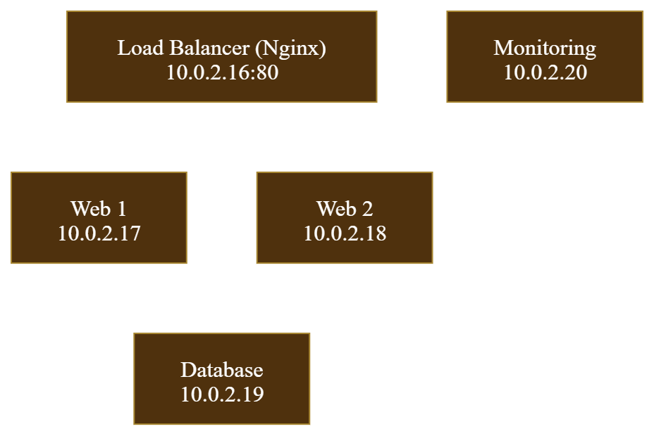
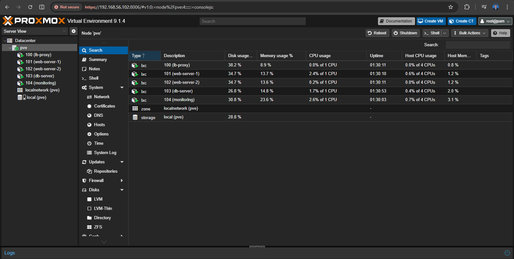
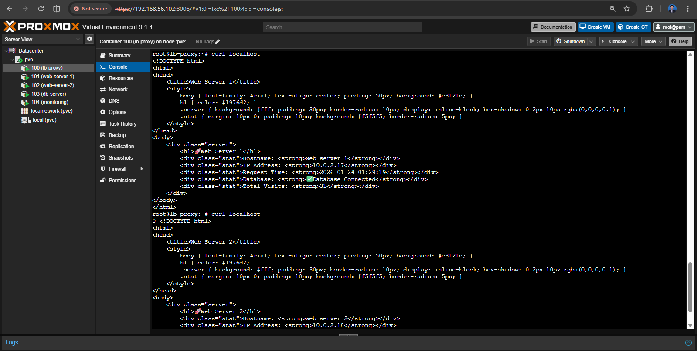
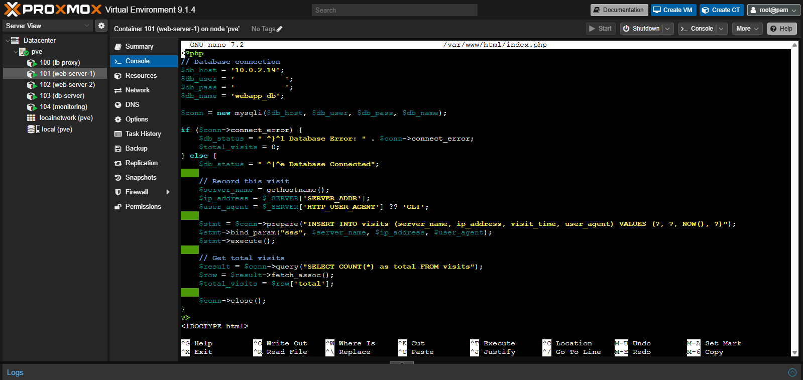
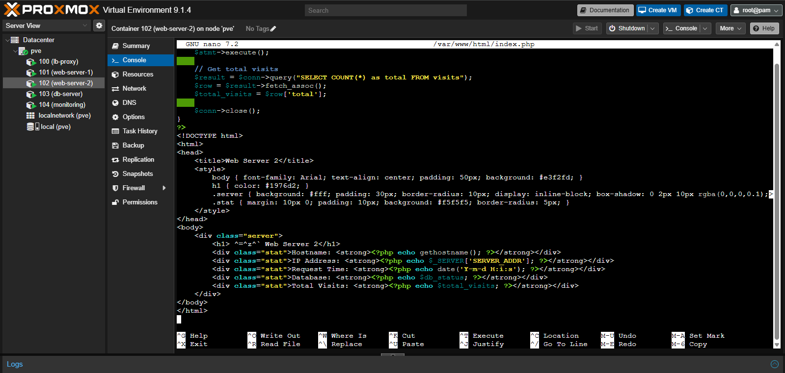
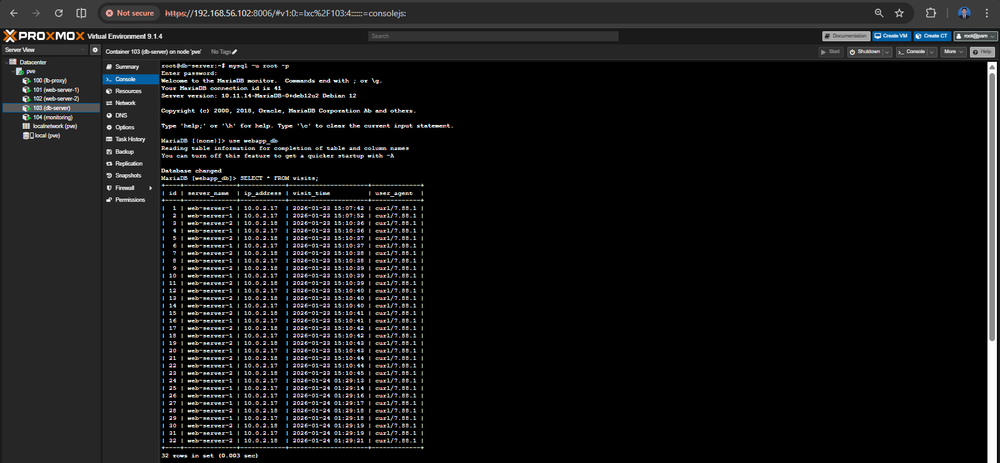
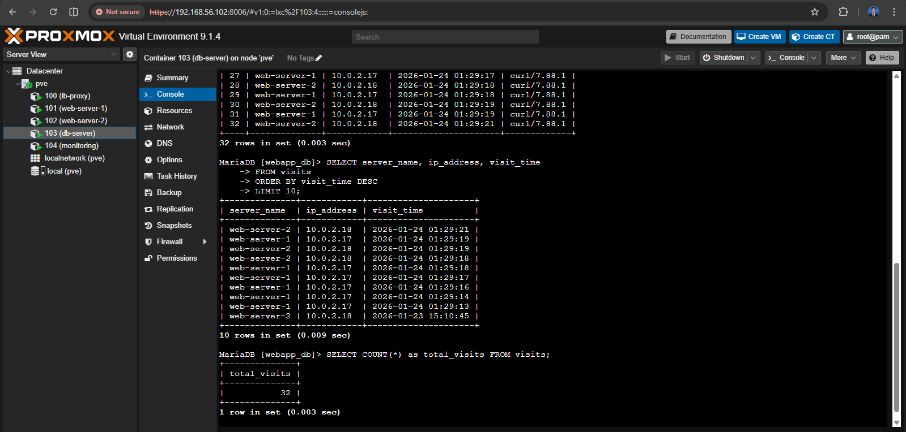
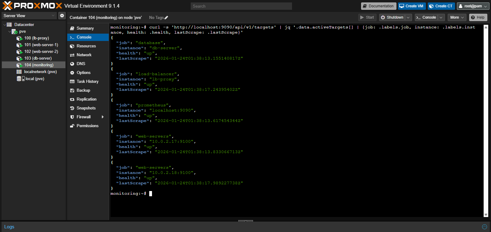

# Production-Ready Web Infrastructure
Portfolio Project - Multi-tier Web Application with Load Balancing & Monitoring

## Architecture Overview

## Components
- **Load Balancer:** Nginx reverse proxy with round-robin distribution
- **Web Servers (2x):** Nginx + PHP-FPM serving dynamic content
- **Database:** MariaDB with visitor tracking
- **Monitoring:** Prometheus collecting metrics from all nodes

## Technologies Used
- Proxmox VE (Virtualization)
- LXC Containers
- Nginx (Load Balancer & Web Server)
- PHP 8.3 + PHP-FPM
- MariaDB (MySQL)
- Prometheus (Monitoring)
- Alpine Linux (Lightweight monitoring)
- Debian 12 & Ubuntu 24.04

## Features Implemented
- ✅ High availability with load balancing
- ✅ Database integration with connection pooling
- ✅ Real-time visitor tracking
- ✅ Infrastructure monitoring
- ✅ Health checks on all services

## Network Topology
- Load Balancer: 10.0.2.16
- Web Server 1: 10.0.2.17
- Web Server 2: 10.0.2.18
- Database: 10.0.2.19
- Monitoring: 10.0.2.20

## Screenshots
### 00. Proxmox Container Overview

### 01. Infrastructure Overview

### 02. Load Balancing Test

### 03. Web Application

### 04. Database Queries

### 05. Prometheus Targets

## Skills Demonstrated
- Container orchestration (LXC)
- Load balancing & reverse proxy configuration
- Database design
- Health Service Monitoring
